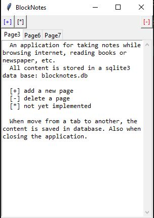

# BlockNotes
Small app for note taking writen in python. The idea is to dump raw information here for a short time; from here information should be organized in [Scriptorium](https://github.com/Zahu2018/Scriptorium).
The project in still in development. So, use it as experimental.

